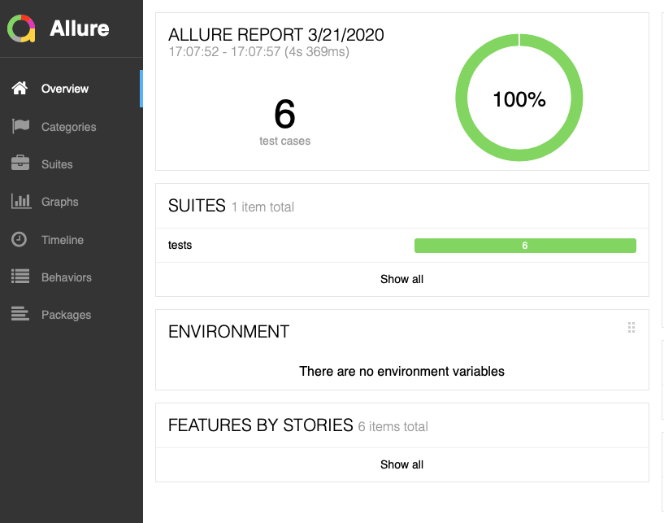
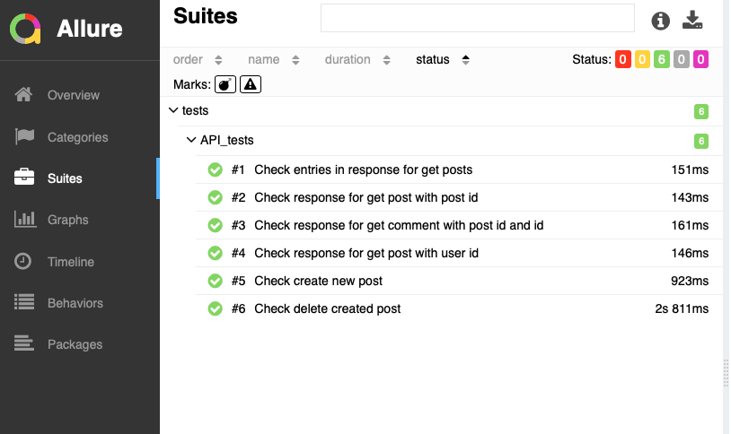

<a href="http://34.89.223.149/viewType.html?buildTypeId=Run_Tests_ID&guest=1">

</a>

# API_Automation_Tests
Tests for REST API: https://jsonplaceholder.typicode.com

# How to run via Docker

### Install [docker](https://www.docker.com/get-started)
### Go to the project folder and run

#### Build docker container

```bash
docker build -t api-tests .
```

#### Run docker container

```bash
docker run -it -rm -p 4200:8000 --name my-running-app api-tests
```

#### During running docker container when all tests will pass open link in a browser to check the actual report [localhost:4200](http://localhost:4200)
### Example of the report

### Overview
<p align = "center">
    
</p>

### Detailed report
<p align = "center">
    
</p>


# How to run locally 

### Install [python3](https://www.python.org/downloads/)
### Go to the project folder and run

#### Create python virtual environment

```bash
python3 -m venv <name_for_venv>
```

#### Activate venv 

```
source <name_for_venv>/bin/activate
```

#### Install all libraries from requirements.txt 

```bash
pip3 install -r requirements.txt
```

#### Run tests

```bash
pytest ./tests/API_tests.py 
```

### If you'd like to see test report
### [Install allure](https://docs.qameta.io/allure/#_installing_a_commandline)

#### Run tests

```bash
pytest --alluredir=./tests/allure/result/ ./tests/API_tests.py 
```

#### Create allure report 

```bush
allure generate -c -o ./tests/allure/report ./tests/allure/result
```

#### Open allure report 

```bush
allure open ./tests/allure/report
```