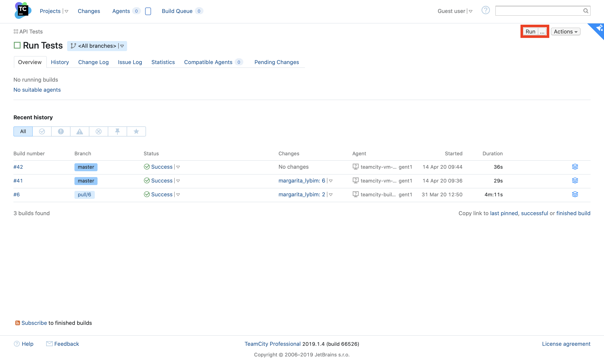
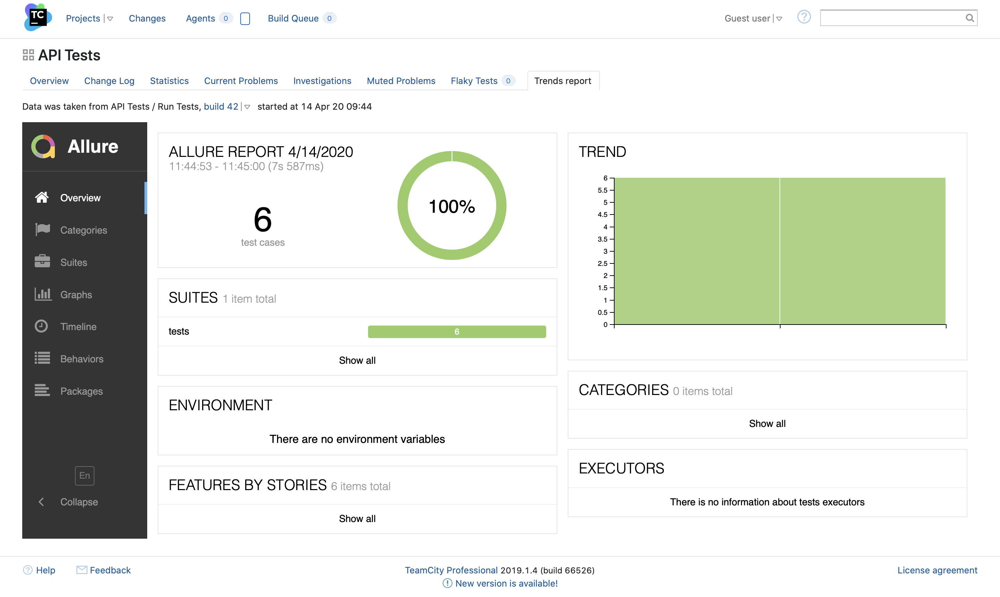
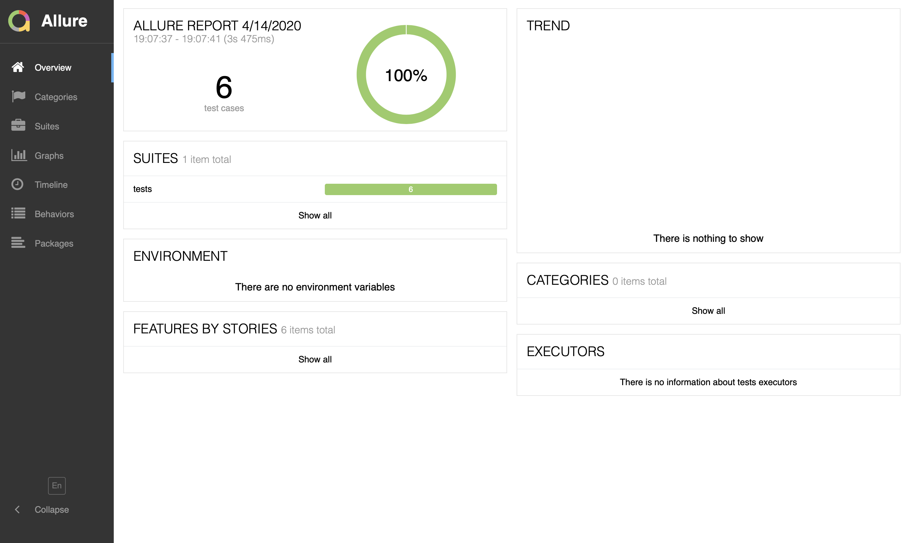
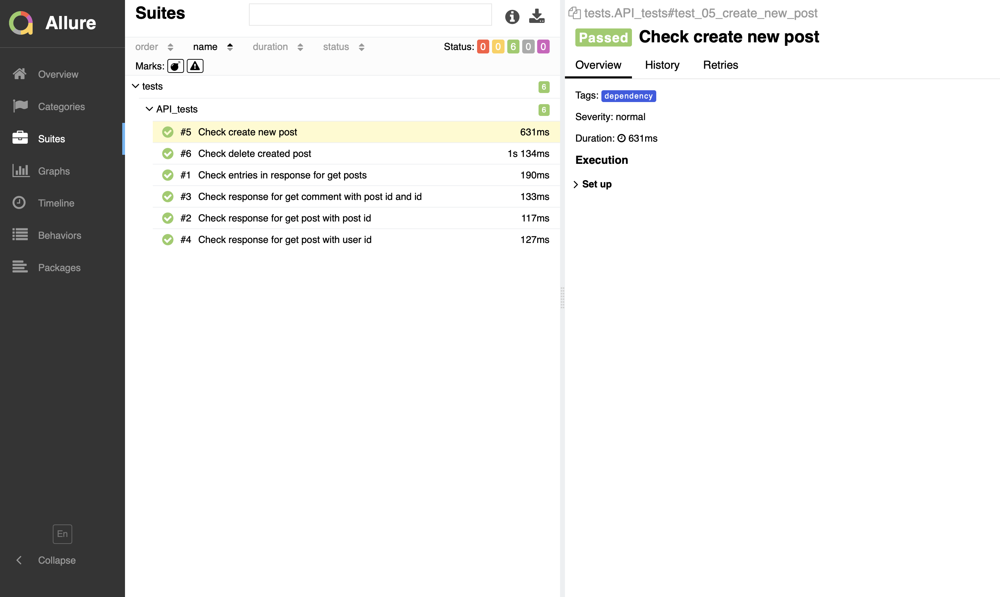

<a href="http://34.89.223.149/viewType.html?buildTypeId=Run_API_Tests_ID&guest=1">

</a>

## API Automation Tests

for REST API: https://jsonplaceholder.typicode.com

## How to run

- [via TeamCity](#How-to-run-via-TeamCity)
- [via Docker](#How-to-run-via-Docker)
- [Locally](#How-to-run-locally)

### How to run via TeamCity

- Go to [CI page](http://34.89.223.149) hosted on GCE VM
- Login as a guest (no username or password required)
- Go to [Run API Tests project](http://34.89.223.149/viewType.html?buildTypeId=Run_API_Tests_ID) and click on run button

<p align = "center">
    
</p>

The first run takes around 5 minutes, even if docker layers are pre-cached, because of starting new GCE VM with build runner, next runs take around 30 seconds.

You can also check logs and allure report on click on build

All artefacts are stored on cloud storage, so you can see historical report across all launches. For that go to [trends report tab of API Test project](http://34.89.223.149/project.html?projectId=API_Tests_ID&tab=preport_project3_Trends_report)

<p align = "center">
    
</p>

### How to run via Docker

- Install [docker](https://www.docker.com/get-started)
- Go to the project folder and run

#### Build docker container

```bash
docker build -t api-tests .
```

#### Run docker container

```bash
docker run -it --rm -p 4200:8000 api-tests
```

When all tests will pass open link in a browser to check the actual report [localhost:4200](http://localhost:4200)

#### Overview

<p align = "center">
    
</p>

#### Detailed report

<p align = "center">
    
</p>

### How to run locally 

- Install [python3](https://www.python.org/downloads/)
- Go to the project folder and run

#### Create python virtual environment

```bash
python3 -m venv <name_for_venv>
```

#### Activate venv 

```
source <name_for_venv>/bin/activate
```

#### Install all libraries from requirements.txt 

```bash
pip3 install -r requirements.txt
```

#### Run tests

```bash
pytest ./tests/API_tests.py 
```

### If you'd like to see test report
- [Install allure](https://docs.qameta.io/allure/#_installing_a_commandline)

#### Run tests

```bash
pytest --alluredir=./tests/allure/result/ ./tests/API_tests.py 
```

#### Create allure report 

```bush
allure generate -c -o ./tests/allure/report ./tests/allure/result
```

#### Open allure report 

```bush
allure open ./tests/allure/report
```
